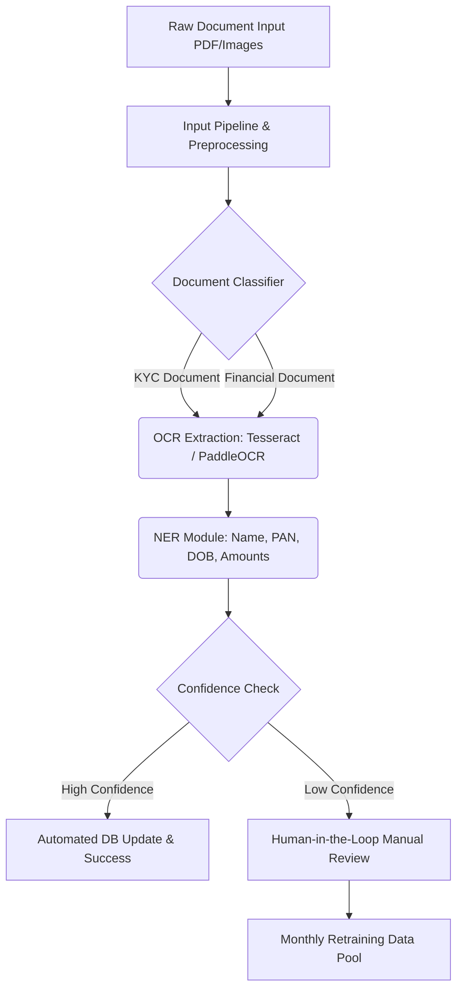

# Banking Document Processing & Information Extraction

## 1. Overview
This project provides a complete Machine Learning Operations (MLOps) pipeline for **Document Processing & Information Extraction**, specifically tailored for the banking sector. The goal is to automate document verification to significantly speed up KYC (Know Your Customer), loan processing, and regulatory compliance.

**ML Tasks:** OCR (Optical Character Recognition) + NER (Named Entity Recognition) + Document Classification.

## 2. Tech Stack
- **Core ML:** PyTorch, HuggingFace Transformers, scikit-learn
- **OCR Engines:** PaddleOCR, PyTesseract
- **API Framework:** FastAPI, Uvicorn
- **MLOps & Tracking:** MLflow, DVC
- **CI/CD:** Jenkins, GitHub Actions
- **Testing:** Pytest, Flake8
- **Data Processing:** Pandas, NumPy, OpenCV

## 3. Problem Statement
Traditional banking institutions rely heavily on manual document verification for KYC processes, onboarding, and loan approvals. This manual process is time-consuming, error-prone, and scales poorly with increasing customer volumes. This project aims to digitize and automate this workflow, extracting key entities automatically while seamlessly routing low-confidence predictions for manual review.

## 4. Model Notes & MLOps Components
- **Input Pipeline:** Supports ingestion of PDFs and raw images (JPG, PNG).
- **OCR Engine:** Utilizes Tesseract and PaddleOCR for robust text extraction.
- **Entity Extraction:** Extracts structured fields including: `Name`, `PAN`, `DOB`, and `Financial Amounts`.
- **Confidence-Based Routing:** Predictions with confidence below a certain threshold are actively routed to a human-in-the-loop manual review queue.
- **Model Versioning:** OCR and NER models are continuously versioned using **MLflow** to track metrics, hyperparameters, and artifacts.
- **Retraining Strategy:** Includes a mechanism for monthly retraining using newly ingested document samples.

## 5. Architecture (Flowchart)


## 6. Repository Structure
```text
banking-mlops-1/
├── .github/
│   └── workflows/
│       └── ci-cd.yml          # GitHub Actions pipeline
├── configs/
│   └── model_config.yaml      # Hyperparameters and model configuration
├── src/
│   ├── __init__.py
│   └── train.py               # Main training pipeline scripts
├── tests/
│   ├── __init__.py
│   └── test_training.py       # Pytest unit tests
├── .gitignore
├── Jenkinsfile                # Jenkins CI/CD pipeline
├── requirements.txt           # Python dependencies
└── README.md                  # Project documentation
```

## 7. Key Features
- **CI/CD Pipelines:** Automated linting, testing, and model training triggered via Jenkins and GitHub Actions.
- **Hyperparameter Management:** Easily configurable model parameters located in `configs/model_config.yaml`.
- **Realistic Data Benchmarks:** Trained and evaluated against Synthetic KYC documents, the **FUNSD** dataset, and the **SROIE** dataset.
- **Real-World Application:** Architected to mimic deployments at large institutions like HDFC, SBI, ICICI, American Express, and HSBC.

## 8. Local Setup (Run Pipeline Locally)
Follow these step-by-step instructions to set up the MLOps pipeline on your local machine:

1. **Clone the repository:**
   ```bash
   git clone <your-repo-url>
   cd banking-mlops-1
   ```
2. **Create a Python Virtual Environment:**
   ```bash
   python3 -m venv venv
   source venv/bin/activate  # On Windows use: venv\Scripts\activate
   ```
3. **Install Dependencies:**
   ```bash
   pip install --upgrade pip
   pip install -r requirements.txt
   ```
4. **Run Unit Tests:**
   Ensure the environment is configured correctly.
   ```bash
   python -m pytest tests/ -v
   ```
5. **Run the Training Pipeline:**
   Execute the core training script, which reads from the configuration file.
   ```bash
   python src/train.py --config configs/model_config.yaml
   ```

## 9. GitHub Actions Workflow
The project includes a robust automated GitHub Action workflow (`.github/workflows/ci-cd.yml`):
- **Trigger:** Activates on pushes to `main` and `develop`, and Pull Requests to `main`.
- **Code Quality & Linting Job:**
   - Checks code formatting utilizing `black` and `isort`.
   - Lints the codebase utilizing `flake8`.
- **Unit & Integration Tests Job:** 
   - Executes unit testing with `pytest`.
   - Auto-generates and archives XML test reports.
- **ML Model Dry-Run & Validation Job:**
   - Validates configuration structures (`params.yaml`).
   - Verifies DVC data versioning status.
   - Runs a dry-pass of the model training script (`src/train.py`).
- **Build & Test Docker Image Job:** 
   - Waits for quality checks, tests, and ML verification to pass.
   - Builds and tags the Docker image with the specific GitHub commit SHA.
   - Runs a temporary container to verify the image launches successfully.

## 10. Generated Artifacts
When executing the pipeline locally or via CI/CD, the following artifacts are generated:
- **`mlruns/`**: Contains logging information tracked by MLflow (parameters, metrics, run logs).
- **`models/`**: Serialized model files (e.g., PyTorch `.pth` files) generated during training.
- **`coverage.xml`**: Code coverage generated by `pytest-cov`, ready to be uploaded to Codecov.

## 11. Python Compatibility
This project is officially supported and verified on **Python 3.9**.
